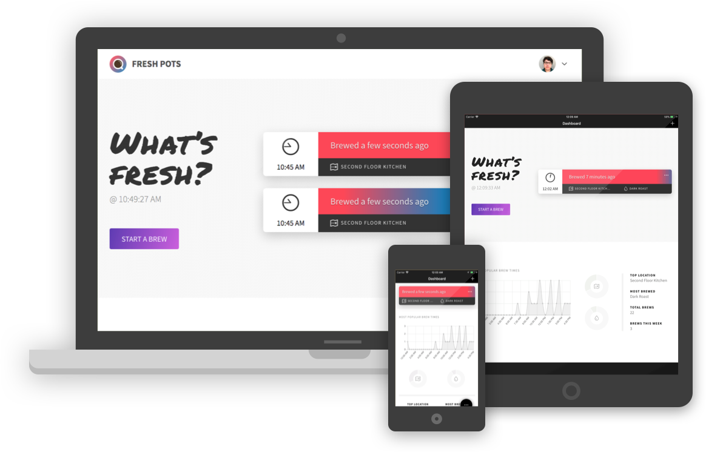

<figure>
  
  <figcaption>
    The Fresh Pots app displayed on different devices.
    Devices template courtesy
    <a href=https://dribbble.com/shots/2084795-Flat-Apple-Device-Family-Freebie">
      Ollie Barker
    </a>
    .
</figure>

So, I've had this idea kicking around for a while and, in the spirit of
making 2018 my Year of Just Fucking Releasing Stuff™, I decided to just
build the thing and send it forth into the world.
  
The idea was pretty simple; to quote the README directly:
  
> There are a lot of coffee pots [where I work](http://theadvocate.com), in
different locations spread across multiple floors and buildings. It’s no fun to
venture out to your nearby coffee station only to be greeted by a stale, tepid
brew. Furthermore, it seems wasteful to make a fresh pot only to have
its contents languish away because no one but you is aware of it.
>
> Fresh Pots is a web application that helps to keep teams *au courant* with
their coffee situation by allowing coffee drinkers to easily log when and
where they start a brew and to quickly scan the freshness of available pots.

## Technology

I built this app pretty fast and loose, in the interest of quickly
bringing it to a satisfactory level of completion and getting it out the
door.

While [Elixir](http://elixir-lang.github.io/) \+
[Phoenix](http://phoenixframework.org/) is my go-to back end stack these
days, I chose Ruby on Rails due to my familiarity with certain Ruby
strategies and libraries (especially
[Devise](https://github.com/plataformatec/devise)).

On the front end, I ended up just delivering plain old server-rendered
pages, with some React sprinkled in where it made sense. While I‘m a React
SPA fan, this decision allowed me to keep all my tests in a single suite.
Navigation is intercepted with Turbolinks for a snappy user experience.

Because, what would any toy app be without some experimentation, I decided
early on that I would try and get an iOS app out the door using the
[native iOS adapter for Turbolinks
5](https://github.com/turbolinks/turbolinks-ios). Since I was already
using the Turbolinks web adapter, this didnt seem like a terribly
outlandish idea.

## Lessons learned

I started Fresh Pots with the intention to allow it to be deployed for any
organization, but I quickly realized that scoping it specifically to my
workplace would cut out a ton of configuration options and admin screens,
so that‘s what I ended up doing.

I did end up publishing [an iOS
app](https://itunes.apple.com/us/app/fresh-pots/id1330049929?ls=1&mt=8),
though the ease of using the Turbolinks iOS adapter was slightly less than
I was hoping—which was my fault. Had I fully read the documentation
beforehand, I would have run across the following:

> By default, Turbolinks for iOS prevents standard HTML form submissions.
> This is because a form submission often results in redirection to
> a different URL, which means the Visitable view controller’s URL would
> change in place.

Getting around this wasn't terribly difficult, and looked a little
something like:

```javascript
export function useXHR(selector, nextURL) {
  ...

  const xhr = new XMLHttpRequest();
  xhr.open("POST", form.action);
  xhr.setRequestHeader("Turbolinks-Referrer", window.location);

  xhr.addEventListener("load", event => {
    Turbolinks.visit(nextURL, { action: "replace" });
  });

  const data = new FormData(form);
  xhr.send(data);

  ...
}
```

Had I realized this limitation from the outset, I could have designed my
forms with it in mind rather than having to go back and implement
a workaround. Don't forget to <abbr title="Read the fucking
manual">RTFM</abbr>!

## Conclusion

I wasn‘t expecting a huge amount of buy-in from my co-workers, and am not
terribly surprised that Fresh Pots is currently hanging out at around 10
users (excluding myself). In any case, it's nice to have something I've
built out in the wild and being used.

As the true goal of this project was to actually release an end product,
I'm calling it a success.

If you're interested in the source code for Fresh Pots, you can find it on
[GitHub](https://github.com/ngscheurich/fresh-pots). If you want to check
out the app in production, it's on the web at [freshpotsapp.com](http://freshpotsapp.com)
and on the [App Store](https://itunes.apple.com/us/app/fresh-pots/id1330049929?ls=1&mt=8);
just keep in mind that there isn't much to see unless you're an Advocate
employee or are just **super** into signup pages.

Onward, to the next thing!

